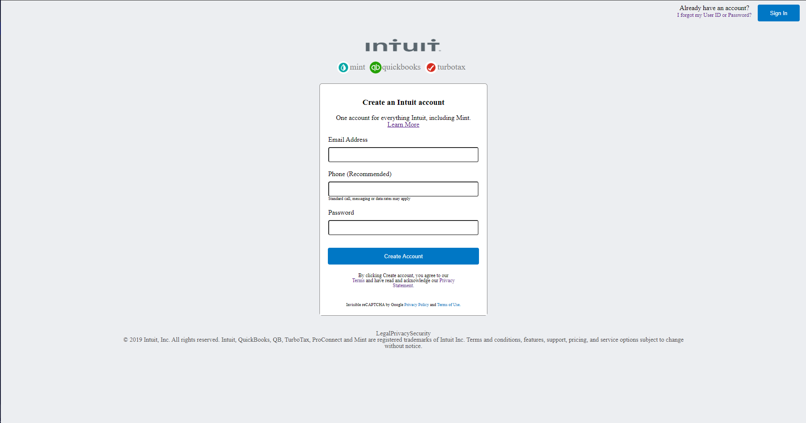

# HTML Forms : Displaying-and-Inputting-Data

## [Collaborative Project]

~ This project consisted of building an HTML document that would match the appearance of [mint.com’s signup page](https://mint.intuit.com/login.event?task=S)

You can find the original project specification [here](https://www.theodinproject.com/courses/html5-and-css3/lessons/html-forms)

|Source Page|The cloned page screenshot|
|:---:|:---:|
|||

## Tools Used

- HTML5
- CSS3
- MarkDown Syntax

## Work Done

- [x] Use Semantic HTML
- [x] Use HTML Forms
- [x] Pass CSS stylelint test
- [x] Check html with W3C validator
- [x] Validate Readme file with markdown lint

LInk to live demo [here](https://christianotieno.github.io/Displaying-and-Inputting-Data/.)

## How to Install and use

- clone the repository ```git clone https://github.com/ChristianOtieno/Displaying-and-Inputting-Data.git```
- open command prompt in ```Displaying-and-Inputing-Data``` folder
- run the application using open live server functionality.

## Authors social links

### 1. Roodz Fernando

- Github: [@RoodzFernando](https://github.com/RoodzFernando)
- Twitter: [@RoodzFernando](https://twitter.com/RoodzFernando)
- Linkedin: [Roodz Fernando](https://www.linkedin.com/in/roodz-fernando-fleurant/)

### 2. Christian Otieno

- Github: [@christianotieno](https://github.com/christianotieno)
- Twitter: [@iamchrisotieno](https://twitter.com/iamchrisotieno)
- Linkedin: [Christian Otieno](https://www.linkedin.com/in/christianotieno/)